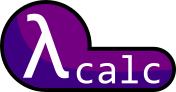

#  A lambda calculus interpreter 


λcalc is a untyped lambda calculus interpreter written in pure Python.


# Features

- Haskell ('\\') or utf8 lambda ('λ') notation
- Leftmost-outermost Beta and/or Eta reduction
- Automatic support for recursively defined terms using fixed point combinators (**extremely slow**)
- Built in support for Church numerals, tuples and lists encoding
- Show/hide reduction steps with statistics (number of reductions and evaluation time)

For now, free variables in terms have to be defined first to use them. Furthermore, they are captured by value.

# Requirements

Python 3, tested on python 3.8 .

# Launching

## Interactive mode

```
python lcalc.py
```
type ``help;`` to show the list of commands and the basic syntax.
## Execute script

```
python lcalc.py "path_to_script.lc"
```

# Libraries

To import a library just run/write:
```
import "path_to_script.lc";
```
Default libraries:
**WARINGING, SUBJECT TO CHANGES**
- ``combinators.lc`` : some fixed point combinators
- ``booleans.lc`` : definition of true/false and conditional structures
- ``numbers.lc`` : some functions for natural numbers (add, sub, pred, ...)
- ``tuples.lc`` : some functions for tuples
- ``lists.lc`` : some functions for lists

# Known issues

Due to the way Python implement its recursive function call stack, big terms (trees with a large depth) will provoke the Python process to panic (Ex: printing a number larger than 10000), resulting in a segmentation fault. The only solution, for now, is to use a stackless Python interpreter (Ex: Stackless Python). 
